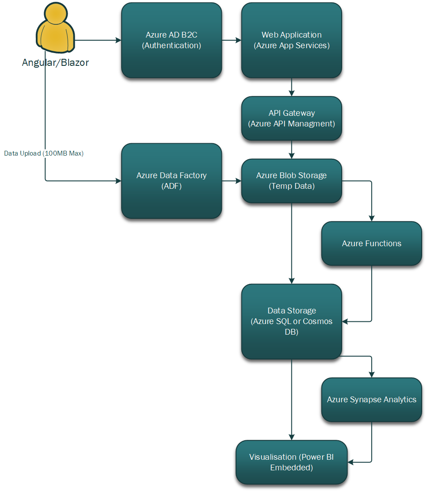

# Data and Advanced Analytics Web Application

This repository outlines the solution architecture for a data and advanced analytics web application built using Azure Cloud services and containers. The solution is designed to be scalable, multi-tenant, and cost-effective, meeting the following high-level requirements:

- Ingest and transform data within 2 minutes for datasets up to 100 MB.
- Provide a web-based interface and API for uploading and downloading data.
- Enable users to query and visualize uploaded data.
- Use Azure B2C for authentication.
- Cost no more than $30,000 USD per year at idle state.
- Be built by a team of no more than 3 people.

---

## Solution Architecture

### Key Components

1. **Data Ingestion and Transformation**
   - **Azure Blob Storage**: Temporarily stores uploaded data before processing. Integrates well with Azure Functios.
   - **Azure Functions**: Handles lightweight, event-driven data processing tasks.

2. **Data Storage**
   - **Azure SQL Database**: Stores structured data and supports querying. Multipke schema or sepate DBs TBD.
   - **Azure Cosmos DB**: Stores unstructured or semi-structured data (if needed).

3. **Data Querying and Visualization**
   - **Azure Synapse Analytics**: Provides advanced querying and analytics capabilities.
   - **Power BI Embedded**: Embeds interactive visualizations into the web application.

4. **Web and API Interface**
   - **Azure App Service**: Hosts the web application and API.
   - **Azure API Management**: Manages and secures the API interface.

5. **Authentication**
   - **Azure Active Directory B2C**: Handles user authentication and authorization.

6. **Containerization**
   - **Azure Kubernetes Service (AKS)**: Manages containerized application deployment. Overly complex for a such a small team.
   - **Docker Containers**: Packages application components (e.g., web app, API, data processing logic).

7. **Monitoring and Logging**
   - **Azure Monitor**: Monitors application performance and health.
   - **Azure Log Analytics**: Centralizes logging and troubleshooting.

---

### Architecture Diagram

---

## Assumptions and Motivations

1. **Data Ingestion and Transformation**
   - Assumption: Data is uploaded in batches (up to 100 MB) and must be processed within 2 minutes.
   - Motivation: Azure Data Factory and Azure Functions are scalable and handle time-sensitive tasks efficiently.

2. **Multi-Tenancy**
   - Assumption: Each tenant has isolated data storage and processing pipelines.
   - Motivation: Azure SQL Database and Cosmos DB support multi-tenant architectures with proper schema design.

3. **Cost Optimization**
   - Assumption: The solution has low usage during idle states.
   - Motivation: Azure Blob Storage, Azure Functions, and Azure SQL Database are cost-effective for small to medium workloads.

4. **Scalability**
   - Assumption: The solution must scale horizontally to handle increasing data volumes and user loads.
   - Motivation: Azure Kubernetes Service (AKS) and Azure App Service provide auto-scaling capabilities.

5. **Development Team Size**
   - Assumption: The team has limited resources (3 people).
   - Motivation: Azure services are managed, reducing operational overhead and allowing the team to focus on development.

---

## Cost Estimation

- **Azure Blob Storage**: ~$20/month for 1 TB of data.
- **Azure Data Factory**: ~$1 per pipeline execution (estimated 100 executions/month = $100/month).
- **Azure Functions**: ~$0.20 per million executions.
- **Azure SQL Database**: ~$150/month for a basic tier.
- **Power BI Embedded**: ~$750/month for a single embedded capacity.
- **Azure App Service**: ~$50/month for a basic plan.
- **Azure Kubernetes Service (AKS)**: ~$100/month for a small cluster.
- **Azure B2C**: ~$0.005 per authentication.

**Total Estimated Cost**: ~$1,200/month (~$14,400/year), well below the $30,000/year limit.

---

## Implementation Plan

A PoC is recommended, to be implemented as a single-person 1 week spike with no cloud usage.
Get client feedback ASAP.

Once the concept is agreed upon:

1. **Phase 1: Data Ingestion and Storage**
   - Set up Azure Blob Storage and Azure Data Factory.
   - Develop data ingestion pipelines using ADF.

2. **Phase 2: Web and API Interface**
   - Develop the web application using Azure App Service.
   - Implement the API using Azure API Management.

3. **Phase 3: Data Querying and Visualization**
   - Set up Azure SQL Database and Power BI Embedded.
   - Develop queries and visualizations.

4. **Phase 4: Authentication and Multi-Tenancy**
   - Integrate Azure B2C for authentication.
   - Implement multi-tenant data isolation.

5. **Phase 5: Containerization and Deployment**
   - Containerize the application using Docker.
   - Deploy to Azure Kubernetes Service (AKS).

---

## Conclusion

This architecture provides a scalable, cost-effective, and multi-tenant solution that meets the requirements and can be built by a small team. Azure services are leveraged to minimize operational overhead and ensure flexibility for future growth.

---

For questions or further details, please contact the project team.